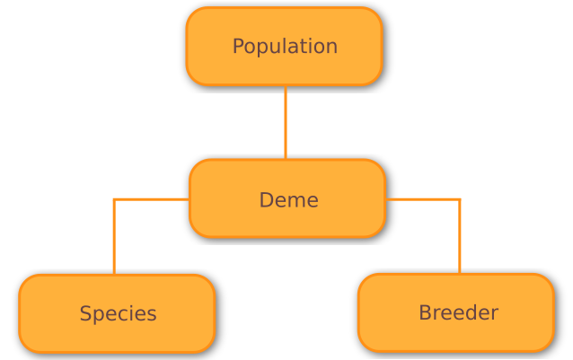

======
Basics
======

Meta.

-------------------------------------------------------------------------------

Algorithm
=========

What is an algorithm?

For the rest of this section, we shall focus on the basics of evolutionary
algorithms within Wallace, rather than covering its other meta-heuristic
algorithms in depth.

Population
==========

Abstractly, the population of the algorithm is used to hold the individuals
which are presently alive within the current generation, as well as their
offspring at that generation.

Like many other evolutionary computation frameworks, Wallace models the
population of an algorithm as a set of demes, or sub-populations, each
containing a (nearly) isolated collection of individuals. Within each
deme, all individuals belong to the same species, but within the population,
each deme may elect to use a different species.

**DIAGRAM**

Simple Populations
------------------

In most cases, one may wish to use only a single deme and species, in which
case one may use the ``population.simple`` model to specify the population,
which effectively ignores the deme (in the eyes of the end-user) model, and
acts as a simpler population.

Complex Populations
-------------------

Island Model
------------

Species
==============

Fitness
=======

Breeding
========
